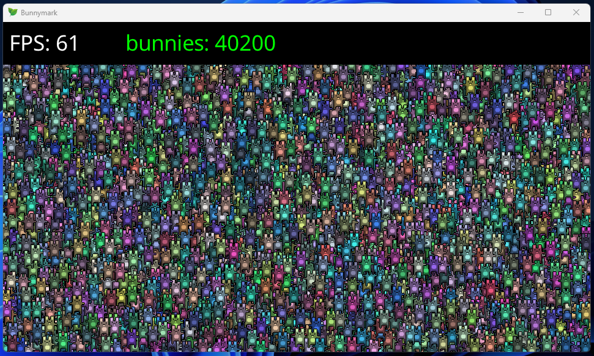

# Pesto 

> **A tiny lua framework.**

Pesto can be used to create any type of program with ease, thanks to its simple [Lua](https://www.lua.org/) interface.
Programs written in it are lightweight, fast, and cross-platform.
Pesto's main dependency is the amazing [Raylib](https://www.raylib.com/), and is heavily influenced by the [Love2D](https://love2d.org/) framework.

The primary motivation behind Pesto's creation was a desire for a lightweight project that emphasized readability, simplicity, and educational value.
It aims to be self-contained, minimizing external dependencies and providing a more comprehensive feature set compared to the basic functionality of Love2D.

The word "Pesto" originates from my favorite Italian sauce, the country i'm from 😋.




## Features

- **Simplicity**: Pesto offers a straightforward API for easy development.
- **Lightweight and Fast**: It's a speedy, single executable framework powered by LuaJIT.
- **Cross-Platform**: Supports various platforms, reducing compatibility issues.
- **Lua Scripting**: Utilizes Lua scripting for flexible development.
- **Versatility**: Beyond games, it's suitable for various applications and tools.
- **Self-Contained**: Includes essential modules, reducing reliance on external libraries.
- **Educational**: Designed to aid learning and experimentation due to its understandable codebase.
- **Community-Driven**: Encourages contributions with clear guidelines and support.
- **Comprehensive Documentation**: Provides detailed, user-friendly documentation with many examples for beginners.

## Getting Started

To get started using Pesto follow the instructions on the [docs](https://vinnyhorgan.github.io/pesto/getting_started/).

Here is the simplest possible program:

``` lua
function pesto.draw()
    pesto.graphics.text("Hello, World!", 0, 0)
end
```

## Building

You can build Pesto from source using CMake. Make sure to clone the project and its submodules, and then follow these steps:

```
mkdir build
cd build
cmake ..
cmake --build . --config Release
```

More details can be found in the [docs](https://vinnyhorgan.github.io/pesto/building/).

## Acknowledgments

Thanks to all these amazing people:

- [Raylib](https://www.raylib.com/)
- [LuaJIT](https://luajit.org/)
- [Love2D](https://love2d.org/)
- [Lovr](https://lovr.org/)
- [ImGui](https://github.com/ocornut/imgui)
- [Enet](https://github.com/lsalzman/enet)
- [Awesome Love2D](https://github.com/love2d-community/awesome-love2d/)
- [MkDocs](https://www.mkdocs.org/)

## License

Pesto is licensed under the MIT License. See the [LICENSE](LICENSE) file for details.
