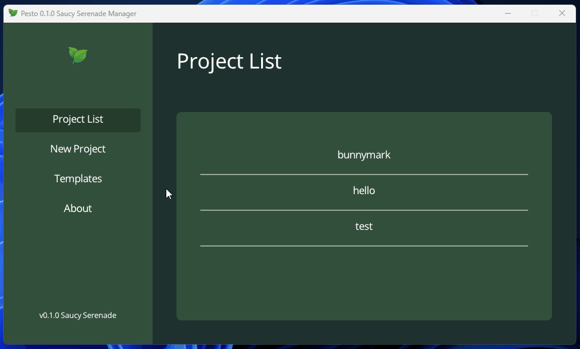

# Getting Started

## Get Pesto

Download the latest Pesto release for your operating system from the [Github page](https://github.com/vinnyhorgan/pesto/releases).
Then open the program and you should be greeted with the project manager!

## Creating a New Project

To create a new project, go to the "New Project" tab, give it a name and press "Create".
This should have created a folder called `projects` next to the Pesto executable.
Inside you will find the project folder, which you can open in your text editor of choice.
If you are unsure just install [VS Code](https://code.visualstudio.com/).

## Hello World

You should now have a basic hello world program which you can run by clicking it in the "Project List" tab!

## Develop

Now you can start writing your masterpiece!
If you need to brush up on your Lua skills check [this](https://learnxinyminutes.com/docs/lua) page.
Check the documentation of the modules below and any examples, you should be up and running in no time!
